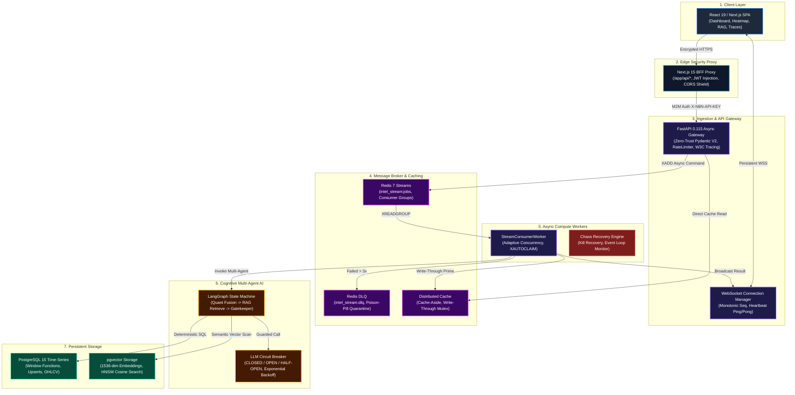

# ⚡ Automated Equity Research Engine: Autonomous FinTech Intelligence Gateway

[-emerald?style=for-the-badge&logo=fastapi)](https://github.com/venkatesh5650/async-fintech-gateway)
[](https://nextjs.org/)
[](https://fastapi.tiangolo.com/)
[](LICENSE)
[-success?style=for-the-badge&logo=pytest)](file:///backend/app/scripts/audit_master_regression.py)
[-purple?style=for-the-badge&logo=ruff)](file:///backend/app/scripts/audit_code_quality.py)

An enterprise-grade, event-driven trading intelligence and quantitative research platform. Built with **Next.js 15 App Router**, **FastAPI**, **Redis Streams**, **PostgreSQL with pgvector**, **LangGraph multi-agent cognitive architecture**, and **W3C distributed tracing**.

This system implements an asynchronous CQRS microservice architecture where quantitative time-series mathematics (SMA, EMA, VWAP, RSI, Bollinger Bands, rolling volatility, Sharpe ratio, cross-asset correlation) are deterministically computed in PostgreSQL window functions, while qualitative document intelligence (SEC EDGAR 10-K/10-Q filing ingestion, chunking, 1536-dimensional L2 normalized embeddings, and HNSW cosine similarity search) powers LangGraph multi-agent synthesis.

---

## 🏗️ System Architecture Blueprint

The platform decouples edge ingress, command ingestion, background workers, and real-time streaming telemetry into a 7-tier zero-trust topology:



---

## 💎 Core Architectural Invariants

1. **LLM Never Computes Math**: All technical indicators (SMA, EMA, VWAP, RSI, Bollinger Bands, Sharpe ratio, Drawdown, correlation coefficients) are calculated natively in PostgreSQL using SQL window functions and common table expressions (CTEs). The LangGraph state machine receives verified numerical metrics.
2. **Asynchronous CQRS**: Write operations (`POST /v1/market-data/ingest`, `POST /v1/documents/upload`, `POST /v1/stress/run`) return `202 Accepted` with a W3C trace-correlated identifier immediately (<15ms). Background processing is handled through Redis Streams consumer groups.
3. **Poison-Pill Quarantine (DLQ)**: Jobs failing more than 3 consecutive deliveries are isolated into `intel_stream:dlq` with failure traces, triggering Discord webhooks and alerting operators without stalling the consumer group.
4. **Adaptive Concurrency & Crash Recovery**: `DynamicConcurrencyController` continuously tunes worker concurrency between 3 and 10 workers based on queue lag. When a worker process terminates abruptly, `XAUTOCLAIM` reclaims abandoned PEL (Pending Entries List) messages within 30 seconds.
5. **Zero-Trust Perimeter**: Next.js 15 Backend-For-Frontend (BFF) proxies all client requests, verifying authentication cookies and injecting `X-N8N-API-KEY` internal headers before contacting the backend.
6. **W3C Distributed Tracing**: Every inbound HTTP request, Redis Stream message, worker execution, and database query propagates a W3C-compliant `traceparent` (`trace_id`, `span_id`), viewable end-to-end in the live waterfall explorer.

---

## 📊 Phase 2 Certification & Milestone Audit Matrix

The platform is verified by automated test and regression suites ensuring 100% pass rates across all operational pillars:

| Milestone | Scope & Capabilities | Automated Audit Script | Assertions | Status |
|:---|:---|:---|:---:|:---:|
| **Phase 1** | Fast Ingestion, Zero-Trust Gatekeeper, PostgreSQL OHLCV, LangGraph, WebSockets | [`audit_system.py`](file:///backend/app/scripts/audit_system.py) | **7 / 7** | ✅ SEALED |
| **M1: Streams & Tracing** | Redis Streams, Consumer Groups, DLQ Isolation, Dynamic Concurrency, W3C Tracing | [`audit_distributed_tracing.py`](file:///backend/app/scripts/audit_distributed_tracing.py) | **7 / 7** | ✅ SEALED |
| **M2: Caching** | Cache-Aside Read Optimization, Write-Through Priming, Distributed Mutex Lock | [`audit_cache_aside.py`](file:///backend/app/scripts/audit_cache_aside.py) | **7 / 7** | ✅ SEALED |
| **M3: Quant Analytics** | SMA/EMA/VWAP, 14D RSI, 20D Bollinger, Sharpe, Drawdown, Pairwise Correlation, Fusion | [`audit_day75_composite.py`](file:///backend/app/scripts/audit_day75_composite.py) | **7 / 7** | ✅ SEALED |
| **M4: Qualitative RAG** | PDF Sliding Chunker, 1536-dim pgvector, HNSW Cosine Search, SEC EDGAR Ingestion | [`audit_rag_pipeline.py`](file:///backend/app/scripts/audit_rag_pipeline.py) | **7 / 7** | ✅ SEALED |
| **M5: Stress & Chaos** | Locust Concurrency Load, Pool Starvation, Redis LRU Pressure, ASGI Drift, XAUTOCLAIM | [`audit_chaos.py`](file:///backend/app/scripts/audit_chaos.py) | **5 / 5** | ✅ SEALED |
| **Capstone: Regression** | Full-Stack Master Regression Orchestrator executing all 5 suites simultaneously | [`audit_master_regression.py`](file:///backend/app/scripts/audit_master_regression.py) | **33 / 33** | ✅ SEALED |
| **Capstone: Architecture** | 7 Architectural Tiers, 14 Micro-Nodes, 16 Directed Edges, Mermaid Spec Contracts | [`audit_architecture_spec.py`](file:///backend/app/scripts/audit_architecture_spec.py) | **5 / 5** | ✅ SEALED |
| **Capstone: Code Quality** | Enterprise Static Analysis, AST Syntax Validation (100% files), Ruff Linter/Formatter | [`audit_code_quality.py`](file:///backend/app/scripts/audit_code_quality.py) | **5 / 5** | ✅ SEALED |
| **Capstone: OpenAPI 3.1** | 61 Endpoints, 10 Domain Tags, 62 Schemas, Security Schemes, Standalone Artifacts | [`audit_openapi_spec.py`](file:///backend/app/scripts/audit_openapi_spec.py) | **5 / 5** | ✅ SEALED |
| **Capstone: Release Sign-Off**| Capstone Metadata, Milestones Verification, Engine Telemetry Health, LOC Footprint | [`audit_phase2_capstone.py`](file:///backend/app/scripts/audit_phase2_capstone.py) | **5 / 5** | ✅ SEALED |
| **Total Assertions** | **Comprehensive Phase 2 End-to-End Verification** | **All 11 Test Suites** | **93 / 93 (100%)** | 🏆 **v0.9.0** |

---

## 🛠️ API Surface & OpenAPI 3.1 Contract Specification

The backend exposes 61 fully documented REST and WebSocket endpoints organized across 10 functional domains. The complete OpenAPI 3.1 specification is synchronized to both [`backend/openapi.json`](file:///backend/openapi.json) and [`frontend/public/openapi.json`](file:///frontend/public/openapi.json).

| Domain Tag | Route Prefix | Capabilities |
|:---|:---|:---|
| **Market Data** | `/v1/market-data` | High-frequency OHLCV tick ingestion, Yahoo Finance failover, batch ingestion |
| **Intelligence** | `/v1/intelligence` | LangGraph signal generation, batch analysis, live CQRS job registry, audit |
| **Analytics** | `/v1/analytics` | SMA/EMA/VWAP crossovers, 14D RSI, Bollinger Bands, rolling Sharpe, correlation |
| **Documents & RAG**| `/v1/documents` | Multipart PDF upload, chunking, 1536-dim pgvector semantic search, SEC EDGAR |
| **System Caching** | `/v1/cache` | Cache-aside inspector, key invalidation, cache metrics, write-through status |
| **Stress Testing** | `/v1/stress` | Locust concurrent load generator, pool starvation simulation, Redis memory load |
| **Architecture** | `/v1/system/architecture` | 7-tier topology inspection, node SLA lookup, dynamic Mermaid diagram export |
| **Code Quality** | `/v1/system/code-quality`| AST syntax checker, ruff linter/formatter analysis, codebase scale metrics |
| **OpenAPI Docs** | `/v1/system/openapi.json`| Interactive OpenAPI 3.1 JSON specification probe |
| **Capstone Report**| `/v1/system/capstone-report`| Production dry run verification, milestone sign-offs, subsystem status |

---

## 🖥️ Operational Console & Interactive Frontend

The Next.js 15 frontend features a unified, dark-themed **Operations Console** providing direct access to all system observability and testing utilities:

* **🏆 Phase 2 Capstone (`/capstone`):** Release sign-off dashboard displaying all 6 milestone summaries, 48+ passing assertions, codebase metrics (60 modules, ~13.5k LOC), and raw JSON export.
* **📖 API Docs Explorer (`/docs`):** Interactive Swagger UI and custom in-browser API explorer with live parameter inputs, "Try It Out" execution tester, and schema viewer.
* **📐 Architecture Blueprint (`/about`):** Full 7-tier system topology visualizer with interactive node SLA inspection, tier catalogs, and live Mermaid diagram renderer.
* **🧹 Code Quality Panel:** Linter report card, AST syntax validation summary, file metrics, and zero-debt status badges.
* **🧪 Master Regression Audit:** Real-time test orchestrator executing all 33 master regression assertions across 5 core test suites with execution progress and telemetry logging.
* **⚡ Stress & Chaos Engineering:** Load test orchestrator, connection pool monitor, Redis memory pressure viewer, ASGI event-loop latency sparklines, and worker kill timeline.
* **📑 Document Library & RAG:** Multi-tenant document uploader, SEC EDGAR filing fetcher, HNSW semantic search explorer, and LLM citation context inspector.
* **📡 Real-Time Telemetry:** Stream health monitor, circuit breaker state controller, DLQ inspector with re-drive controls, and W3C distributed trace waterfall viewer.

---

## ⚡ Quickstart & Local Setup

### Prerequisites
* Docker & Docker Compose
* Python 3.11+
* Node.js 18+ & npm

### 1. Clone & Configure Environment

```bash
git clone https://github.com/venkatesh5650/async-fintech-gateway.git
cd async-fintech-gateway

# Backend environment setup
cp backend/.env.example backend/.env
# Frontend environment setup
cp frontend/.env.example frontend/.env.local
```

### 2. Boot Local Infrastructure (PostgreSQL + pgvector & Redis 7)

```bash
cd backend
docker-compose up -d postgres redis
```

### 3. Start Backend Compute Gateway & Consumer Worker

```bash
# In backend directory with Python virtualenv activated:
pip install -r requirements.txt

# Apply database migrations
alembic upgrade head

# Start FastAPI Gateway Server
python -m uvicorn app.main:app --host 127.0.0.1 --port 8000 --reload

# In a separate terminal, launch the Redis Streams Worker:
python -m app.workers.stream_worker
```

### 4. Start Next.js Edge Frontend

```bash
cd frontend
npm install
npm run dev
```

Navigate to [http://localhost:3000](http://localhost:3000) for the primary dashboard, [http://localhost:3000/docs](http://localhost:3000/docs) for the API Explorer, [http://localhost:3000/capstone](http://localhost:3000/capstone) for the Phase 2 Capstone Sign-off, and [http://localhost:3000/about](http://localhost:3000/about) for the Architecture Blueprint.

### 5. Execute Full-Suite Regression & Verification

```bash
cd backend
# 1. Run Master Regression Audit (33 assertions)
python -m app.scripts.audit_master_regression

# 2. Run Code Quality & AST Audit (5 assertions)
python -m app.scripts.audit_code_quality

# 3. Run OpenAPI 3.1 Spec Audit (5 assertions)
python -m app.scripts.audit_openapi_spec

# 4. Run Phase 2 Capstone Certification Audit (5 assertions)
python -m app.scripts.audit_phase2_capstone
```

---

## 🗺️ Roadmap Evolution

* **✅ Phase 1 (Days 1–60):** Core Engine, Zero-Trust Gateway, PostgreSQL Time-Series, WebSockets, LangGraph (`v0.6.0`).
* **✅ Phase 2 (Days 61–90):** Redis Streams, Caching, Quant Analytics, pgvector RAG, Chaos Engineering, Master Regression, OpenAPI 3.1, Production Dry Run (`v0.9.0`).
* **🔄 Phase 3 (Days 91–100):** Live Cloud Orchestration (Multi-stage Docker, Render/AWS Deploy, Prometheus `/metrics`, Grafana Dashboards, UptimeRobot, `v1.0.0-rc`).
* **🔮 Phase 3 (Days 101–120):** "Build in Public" Architectural Artifacts & US Founder Infiltration.
