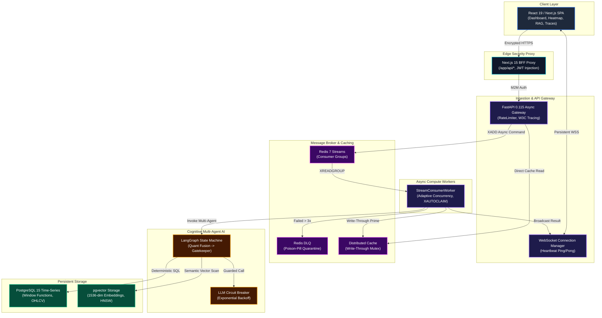

# ⚡ Automated Equity Research Engine

[](https://nextjs.org/)
[](https://fastapi.tiangolo.com/)
[](LICENSE)

An enterprise-grade, event-driven trading intelligence and quantitative research platform. Built with **Next.js 15 App Router**, **FastAPI**, **Redis Streams**, **PostgreSQL with pgvector**, **LangGraph multi-agent cognitive architecture**, and **W3C distributed tracing**.

This system implements an asynchronous CQRS microservice architecture where quantitative time-series mathematics (SMA, EMA, VWAP, RSI, Bollinger Bands, rolling volatility, Sharpe ratio, cross-asset correlation) are deterministically computed natively in PostgreSQL window functions, while qualitative document intelligence (SEC EDGAR 10-K/10-Q filing ingestion, chunking, 1536-dimensional L2 normalized embeddings, and HNSW cosine similarity search) powers LangGraph multi-agent synthesis.

---

## ✨ Key Capabilities

*   **Quantitative Analytics Engine:** Natively computes complex technical indicators (SMA, EMA, VWAP, RSI, Bollinger Bands, Sharpe ratio, Drawdown, correlation coefficients) using optimized SQL window functions and CTEs, ensuring the LLM never hallucinates mathematical computations.
*   **Qualitative Document Intelligence (RAG):** Multi-tenant document ingestion for SEC EDGAR filings, PDF sliding chunking, 1536-dimensional L2 normalized vector embeddings, and ultra-fast HNSW cosine similarity search via `pgvector`.
*   **Cognitive Multi-Agent AI:** State-of-the-art LangGraph state machine orchestrates quantitative metric fusion, context retrieval, and decision synthesis with deterministic guardrails.
*   **Asynchronous CQRS & Event-Driven Workers:** Fully decoupled read/write paths. Ingress commands return immediately, offloading complex tasks to adaptive background workers via Redis Streams.
*   **Enterprise Reliability:** Built-in poison-pill quarantine (DLQ), adaptive worker concurrency, chaos recovery mechanisms, and resilient connection pooling.
*   **End-to-End Observability:** Complete W3C distributed tracing across all HTTP requests, stream messages, database queries, and AI invocations, viewable in a live telemetry waterfall.

---

## 🏗️ System Architecture Blueprint

The platform decouples edge ingress, command ingestion, background workers, and real-time streaming telemetry into a zero-trust topology:



### Core Invariants
1. **Deterministic Analytics**: LLMs are never used for math. All indicators and statistical correlations are resolved at the database layer.
2. **Asynchronous Processing**: Intensive operations (market data ingestion, PDF parsing, stress tests) are queued instantly (<15ms response) and processed by horizontally scalable stream workers.
3. **Resilience by Design**: Jobs failing repeatedly are isolated to a Dead Letter Queue (DLQ). Workers dynamically scale, and abandoned tasks are auto-reclaimed using `XAUTOCLAIM`.
4. **Zero-Trust**: The Next.js Backend-For-Frontend (BFF) securely handles all client interactions, verifying authentication and proxying requests transparently.

---

## 🛠️ API & Extensibility

The backend exposes a highly structured REST and WebSocket API documented fully via OpenAPI 3.1. 

*   **Market Data (`/v1/market-data`)**: High-frequency OHLCV tick ingestion, failover mechanisms, and bulk processing.
*   **Intelligence & Analytics (`/v1/intelligence`, `/v1/analytics`)**: LangGraph signal orchestration, batch analysis, CQRS job registry, and complex technical indicator computation.
*   **Documents & RAG (`/v1/documents`)**: Robust PDF parsing, multi-part uploads, vector embeddings, and SEC EDGAR integrations.
*   **System & Operations (`/v1/cache`, `/v1/stress`, `/v1/system/*`)**: Real-time cache inspectors, load simulation, architecture blueprint metadata, and API documentation.

> **Note:** The complete OpenAPI 3.1 specification is available in the integrated API Explorer or directly via `/v1/system/openapi.json`.

---

## 🖥️ Operational Console

The Next.js frontend acts as a unified operations center to monitor, interact with, and debug the platform:

*   **API Explorer:** Interactive Swagger UI for live execution and endpoint testing.
*   **Architecture Blueprint:** Dynamic visualizer for system topology, SLA inspection, and active connections.
*   **Document Library & RAG:** Interface for uploading filings, executing semantic searches, and interacting with LLM-synthesized contexts.
*   **Real-Time Telemetry:** Stream health, live circuit breaker controls, DLQ oversight, and W3C distributed trace waterfall visualizations.
*   **Stress & Chaos Engineering:** Execute controlled load tests, simulate connection pool starvation, monitor Redis memory pressure, and observe event-loop latencies.

---

## ⚡ Quickstart & Local Setup

### Prerequisites
*   Docker & Docker Compose
*   Python 3.11+
*   Node.js 18+ & npm

### 1. Environment Setup

```bash
git clone https://github.com/venkatesh5650/async-fintech-gateway.git
cd async-fintech-gateway

# Configure backend environment
cp backend/.env.example backend/.env

# Configure frontend environment
cp frontend/.env.example frontend/.env.local
```

### 2. Boot Local Infrastructure

Start the supporting services (PostgreSQL with pgvector and Redis 7):
```bash
cd backend
docker-compose up -d postgres redis
```

### 3. Launch Backend Compute & Workers

```bash
# In the backend directory with your Python virtual environment activated:
pip install -r requirements.txt

# Apply database migrations
alembic upgrade head

# Start FastAPI Gateway Server
python -m uvicorn app.main:app --host 127.0.0.1 --port 8000 --reload

# In a separate terminal, launch the Redis Streams Worker:
python -m app.workers.stream_worker
```

### 4. Start Next.js Frontend

```bash
cd ../frontend
npm install
npm run dev
```

The Operational Console is now available at [http://localhost:3000](http://localhost:3000). You can explore the API via [http://localhost:3000/docs](http://localhost:3000/docs) and view the Architecture Blueprint at [http://localhost:3000/about](http://localhost:3000/about).
